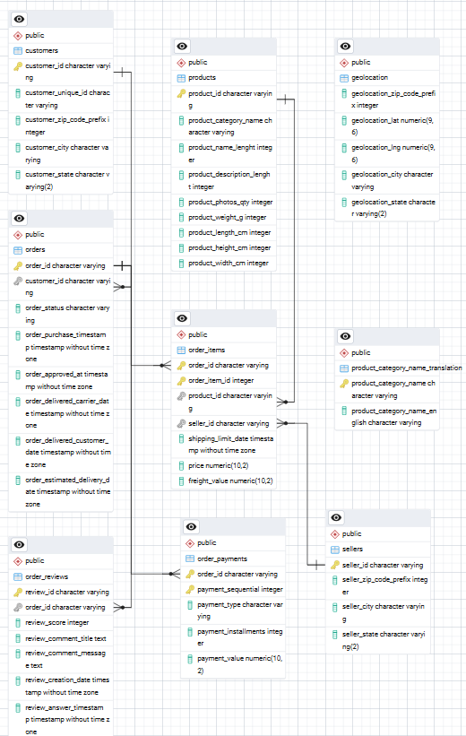
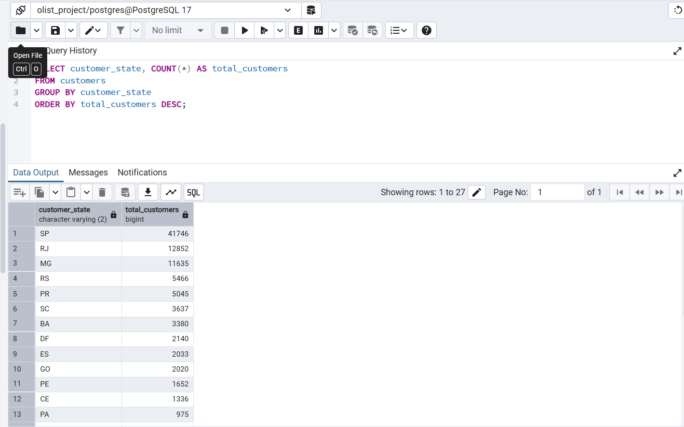
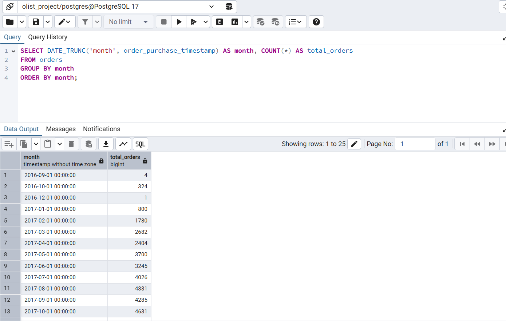
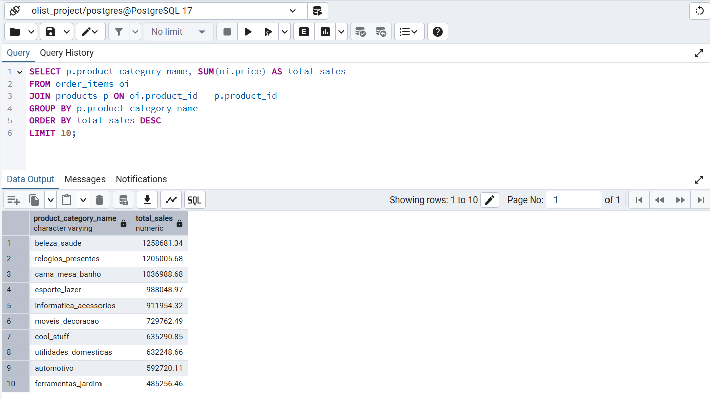

# ATK Analytics

## Company Background
Olist is a Brazilian e-commerce marketplace that connects small businesses to major marketplaces.  
As an analytics company partnering with Olist, our work is to analyze sales, customers, products, and delivery performance.  
The project focuses on building a relational database, running SQL queries, and creating visual analytics that help Olist improve decision-making.

---

## Project Overview
This project imports the **Olist Brazilian E-commerce dataset** into PostgreSQL, builds a database schema, and analyzes customer behavior, sales, delivery times, and reviews.  
It demonstrates data modeling, SQL queries, Python scripting, and will later expand into interactive dashboards (Apache Superset).

---

## Database Schema (ERD)


The database contains the following tables:
- **customers** (customer information)  
- **orders** (order details)  
- **order_items** (items within each order)  
- **products** (product catalog)  
- **sellers** (seller details)  
- **order_payments** (payment details)  
- **order_reviews** (customer reviews)  
- **geolocation** (customer & seller geolocation data)  
- **product_category_name_translation** (translation of product categories)

---

## Tools & Technologies
- **Database:** PostgreSQL  
- **Scripting:** Python 3.10+  
- **Libraries:** psycopg2, pandas  
- **Visualization (future):** Apache Superset  
- **Version Control:** Git & GitHub  

---

## How to Run the Project

## 1. Database Setup
- Install PostgreSQL.
- Create database
CREATE DATABASE olist_project;
- Run tables.sql to create all tables.
- Import CSV data

## 2. Run Queries
- Run queries in queries.sql to check imports and perform analytics.
SELECT COUNT(*) FROM customers;

## 3. Run Python Script
- pip install psycopg2-binary pandas
- Update your DB credentials inside main.py.
- Run: python main.py

## Example Analytics



---

Monthly order trends


---

Top-selling product categories


### 1. Clone Repository
```bash
git clone https://github.com/yourusername/olist-project.git
cd olist-project
